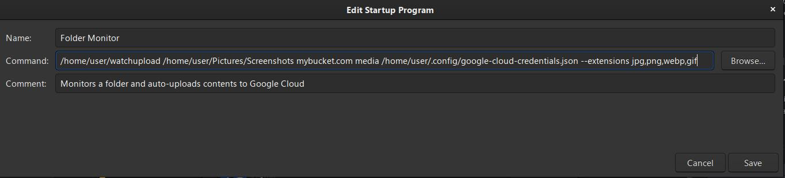

# Linux Directory Monitor & upload to Google Cloud Bucket

Python script to:

- monitor a directory
- Detect when new files from a specified list of extensions are added
- Upload the file to specified bucket on Google Cloud
- Create a shortened link to the file with is.gd
- Copy the shortened link to clipboard
- Show an alert

## 1. Create bucket & service account on Google Cloud

Follow the instructions in the first part of [this article](https://medium.com/google-cloud/automating-google-cloud-storage-management-with-python-92ba64ec8ea8)
to create a Bucket in Google Cloud and a Service Account to access it from the python script.

## 2. Run Executable

usage: `watchupload [-h] [--extensions EXTENSIONS] folder_path bucket_name bucket_folder credentials`

### Positional arguments:

- `folder_path`  Path to the folder to watch
- `bucket_name`  Bucket name to upload files to
- `bucket_folder`  Folder in bucket to upload files to
- `credentials` Path to the credentials JSON file downloaded from Google Cloud Platform

### Options:
`-h`, `--help` show this help message and exit

`--extensions EXTENSIONS`
Comma-separated list of file extensions to listen for.  If not set will listen for any file uploaded to directory.

### Example:
```
./dist/watchupload /home/user/Pictures/Screenshots mybucket.com media /home/user/.config/google-cloud-credentials.json --extensions jpg,png,webp,gif
```

## 3. Start Automatically on boot
Copy the executable to `~/.local/bin`

```
cp ./dist/watchupload ~/.local/bin/
```

Open **Startup Applications** and paste in the command to start the watcher:

Seems to only work with an absolute path to the executable:

```
/home/user/watchupload /home/user/Pictures/Screenshots mybucket.com media /home/user/.config/google-cloud-credentials.json --extensions jpg,png,webp,gif
```



